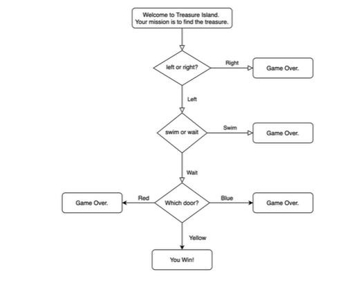

# Project 3 : Treasure Island
Beginner Challange : 
The Treasure Island Python program utilizes control flow structures and logical operators to create a text-based adventure game, where user decisions determine the outcome of the story, leading to either success or failure.

