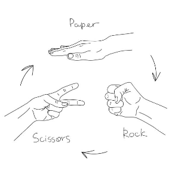

# Project 4  : RockPaperScissor
Beginner Challange : 
The Rock, Paper, Scissors Python program incorporates randomization using the random module and utilizes Python lists to manage the game's choices, allowing the user to play against the computer with dynamically generated outcomes.

