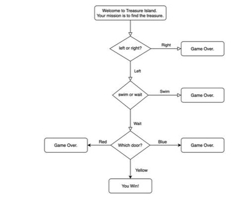
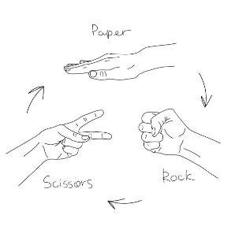

# Python-in-100-days
created by Haftamu M

Python programming challenge that spans 100 days and 100 Projects by Dr. Angela Yu on Udemy

| Date | Project #| Project Description  | 
| :---         |     :---      |          :--- |  
| 01/02/2024   | Project 1: Band Name Generator | Beginner - Working with variable     |
| 01/02/2024   | Project 2: Tips Calculator   | Beginner - Understanding Data Types   |
| 01/02/2024   | Project 3: Treasure Island   | Beginner - Control Flow  and Logical Operators  |
| 01/03/2024   | Project 4: RockPaperScissor | Beginner - Radomisation and Python Lists     |
| 01/03/2024   | Project 5: Password Generator  | Beginner - Python Loops   |
| 01/03/2024   | Project 6: Escaping the Maze  | Beginner - Python Functions and Karel  |
| 01/03/2024   | Project 7: Hangman  | Beginner - Hangman |
| 01/03/2024   | Project 8: Caesar Cipher  | Beginner - Function Parameters & Caesar Cipher |
| 01/03/2024   | Project 9: Secret Auction Program  | Beginner - Dictionaries, Nesting and Secret Auction |
| 01/03/2024   | Project 10: Calculator | Beginner - Functions and Output |

# Project 1 : Band Name Generator 
Beginner Challange :
The Band Name Generator is a Python program that utilizes lists, random number generation, and string concatenation to create and display a unique band name by selecting random adjectives and nouns.

# Project 2 : Tip Calculator
Beginner Challange : 
The Tip Calculator is a Python program employing user input, mathematical operations, and formatted output to calculate and display the tip amount based on a bill and user-specified tip percentage.

# Project 3 : Treasure Island
Beginner Challange : 
The Treasure Island Python program utilizes control flow structures and logical operators to create a text-based adventure game, where user decisions determine the outcome of the story, leading to either success or failure.

# Project 4  : RockPaperScissor
Beginner Challange : 
The Rock, Paper, Scissors Python program incorporates randomization using the random module and utilizes Python lists to manage the game's choices, allowing the user to play against the computer with dynamically generated outcomes.

